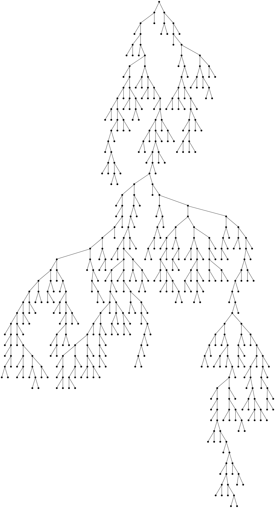

# Equal Fringes and Coroutines
<div align=center></div>

### Fringe problems

The fringe of a tree with labelled leaves is the sequence formed by reading its leaves from left-to-right.
The equal (or same) fringe problem asks for an algorithm to test if two binary trees have equal fringes.

### Coroutines

For a tree of L leaves, this is easy to answer in O(L) time and space. If the supplied tree has depth d, then it is very
instructive to try and write an implementation using only O(d) space. This turns out to be reasonably tricky without
using a coroutine (e.g. "yield" in C# or Python). As a result, it's a great way to understand or teach what is going on
at a language level when a coroutine is used. When I tried, I had a strong desire to have a recursive function that 
called into the "middle" of itself, which is pretty much what a coroutine does for us by saving state behind the scenes.
This repo contains various implementations, the most instructive, at least for me, being the ExplicitState implementation.

I can't resist pointing out that the algorithms in this repo are equivalent to this Haskell, which also only requires 
O(d) space:

```Haskell
data Tree = Node Tree Tree | Leaf Int
equalFringe :: Tree -> Tree -> Bool
equalFringe t1 t2 = (fringe t1) == (fringe t2)
           where 
             fringe (Leaf v) = [v]
             fringe (Node left right) = (fringe left) ++ (fringe right)
```

### Random Trees

Generating random trees to test these implementations is slightly interesting. It turns out that trying to generate a random
binary tree by, say, flipping a coin at each node and using that to decide whether to add children doesn't work well
(e.g., half of all trees will be just a root node :)). It turns out an extremely simple algorithm can generate random trees 
close to a desired number of nodes in expected time linear in the number of desired nodes. The algorithm used in this repo is from
```
Duchon, Philippe, et al. “Boltzmann samplers for the random generation of combinatorial structures.” 
Combinatorics Probability and Computing 13.4-5 (2004): 577-625.
```
I based my implementation on the lovely Haskell implementation at [Brent Yorgey's great blog](https://byorgey.wordpress.com/2013/04/25/random-binary-trees-with-a-size-limited-critical-boltzmann-sampler-2/).

Lastly, there are implementations in many languages at:

* http://c2.com/cgi/wiki?SameFringeProblem
* http://rosettacode.org/wiki/Same_Fringe


